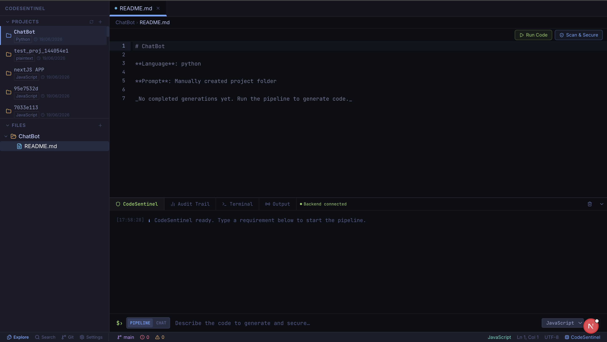
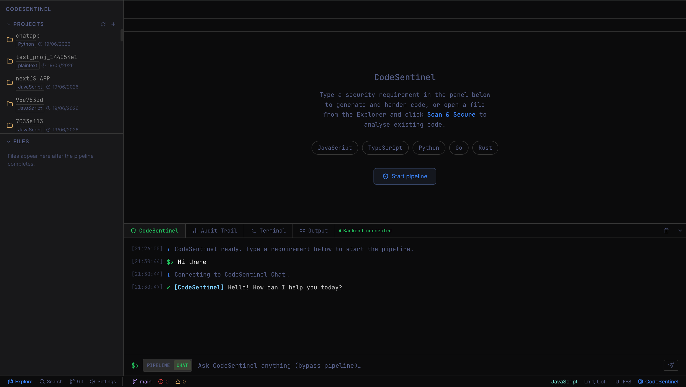
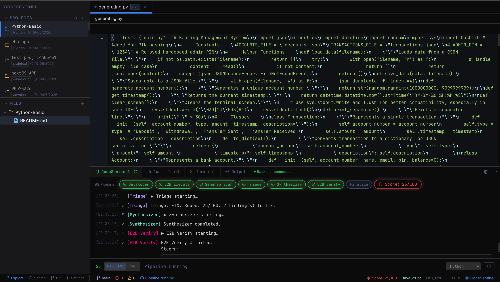
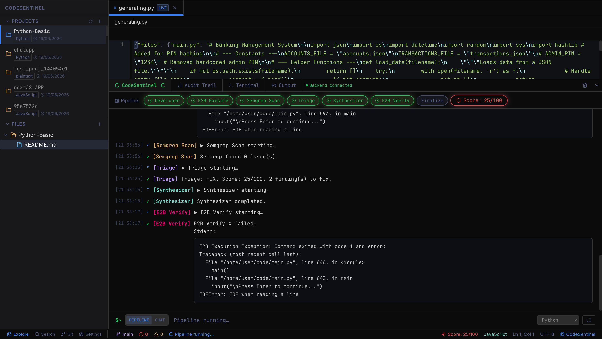
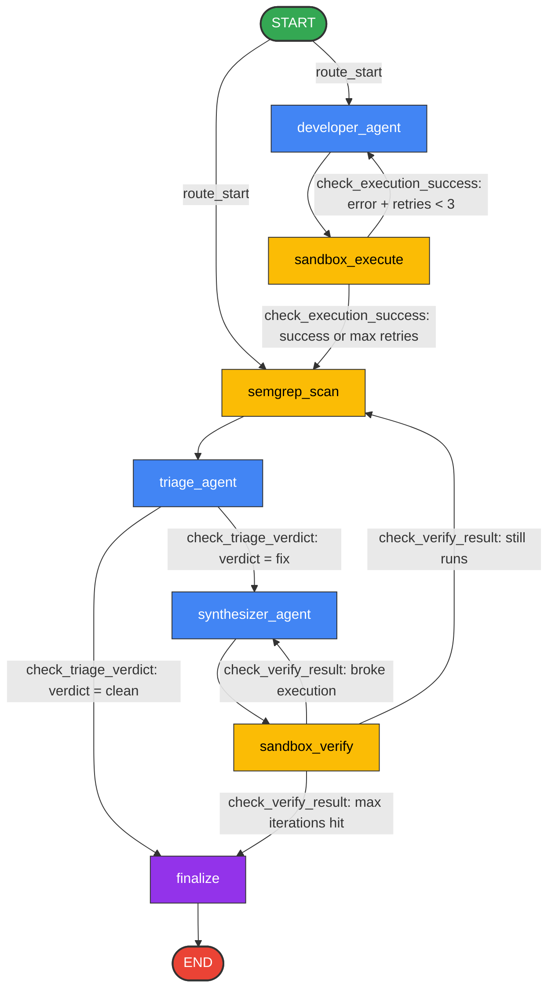

# 🛡️ CodeSentinel
### *LangChain & LangGraph Orchestrated Autonomous DevSecOps Pipeline & Collaborative IDE*

---

[](https://github.com/langchain-ai/langchain)
[](https://github.com/langchain-ai/langgraph)
[](https://fastapi.tiangolo.com/)
[](https://www.docker.com/)

[](https://deepmind.google/technologies/gemini/)
[](https://semgrep.dev/)
[](https://supabase.com/)
[](https://www.sqlite.org/)
[](https://jwt.io/)
[](https://xtermjs.org/)
[](https://codemirror.net/)

CodeSentinel is a production-grade, state-of-the-art **autonomous DevSecOps pipeline** married to an **interactive browser-based IDE**. 

Traditional software pipelines rely on passive warnings or manual audits. CodeSentinel implements an **AI-driven self-healing coding loop** where multiple specialized agents, Docker containers, and Semgrep static analyzers collaborate within a strict state machine built on **LangChain** and **LangGraph**. Code changes are written, run, audited for CWE vulnerabilities, patched, and regression-tested—completely autonomously—streaming live state telemetry to the user via Server-Sent Events (SSE).

---

## 📽️ Interactive Demo Video

Below is the walk-through demo showing CodeSentinel analyzing a coding requirement, compiling the source in Docker, running Semgrep, identifying vulnerabilities, and executing self-healing synthesizer cycles.

<video src="./frontend/public/demo-video.mp4" width="100%" height="auto" controls loop autoplay muted></video>

---

## 🎨 Unified IDE Tour & Screenshots

Below is the screenshots walkthrough, mirroring the dark-mode cyber design of CodeSentinel:

### 1. Interactive Coding Companion

* **Agent Chat & Command Prompt**: Start standard conversations or trigger the multi-agent compiler graph using natural language prompts.
* **Auto-Compile Prompts**: Translates instructions directly into code blocks.

### 2. Modern DevSecOps Workspace

* **High-Fidelity Code Editor**: Core writing canvas with Tokyo Night theme, complete with `Run Code`, `Format (Prettier)`, and `Scan & Secure` controls.
* **Vulnerability Scorecard**: Live health meter displaying structural code security score (0% to 100%).

### 3. Real-Time Agent Trace Logs

* **SSE State Telemetry**: Real-time event streams showing the status of the LangGraph compiler nodes.
* **Semgrep SAST Integration**: Highlights CWE classifications, line numbers, and actionable remediation steps.

### 4. Isolated Docker PTY Terminal

* **Full-Duplex Interactive Shell**: Links character streams to a PTY shell inside the container, tracking code adjustments automatically.
* **Dynamic Local Port Forwarding**: Safely routes ports (e.g., port 3000 to 3002) alongside HTTP headers processing proxy.

---

## 🧠 LangGraph Orchestrator Flow

The LangGraph state machine controls the pipeline logic. The workflow guarantees that code is executed, scanned, and healed before being marked clean.

### Graph Topology


### Node Transition Rules
1. **`route_start`**: Entry-point router. If the request supplies pre-written code (skipping initial generation), bypasses `developer_agent` and routes directly to `semgrep_scan`. Otherwise, launches `developer_agent`.
2. **`check_execution_success`**: Runs after `sandbox_execute`. If execution fails and retries are under the configuration limit (default: 3), redirects back to `developer_agent` with error stacktraces. Otherwise, routes to `semgrep_scan`.
3. **`check_triage_verdict`**: Evaluates the output of `triage_agent`. If the code has no vulnerabilities (verdict is clean) or the iteration limit is reached, routes to `finalize`. If vulnerabilities are confirmed, routes to `synthesizer_agent`.
4. **`check_verify_result`**: Evaluates `sandbox_verify` metrics. If the patched code compiles and runs, routes to `semgrep_scan` for another security scan iteration. If the patch broke the runtime, routes back to `synthesizer_agent`. If the security iteration limit (default: 3) is hit, routes to `finalize`.

---

## ⚡ Technical Deep-Dives

### 1. Dynamic Port Forwarding Proxy & Framing Bypasses
To display web applications running inside the container (e.g. port 3000 Node.js servers) directly inside the IDE browser frame without CORS or framing blocks (`refused to connect`), the backend mounts a **header-stripping proxy** at `/api/terminal/{session_id}/proxy`:
1. **Target Routing**: Determines the container's mapped port from the Docker SDK and routes request traffic to `http://localhost:{port}/{path}`.
2. **Security Headers Removal**: Strips incoming `X-Frame-Options` and `Content-Security-Policy` response headers in-flight, allowing framing.
3. **Cookie Redirection**: Rewrites Cookie `Path` headers to align with the proxy base path `/api/terminal/{session_id}/proxy/`, preserving application sessions.
4. **Relative Path Alignment**: Intercepts HTML streams and injects `<base href="/api/terminal/{session_id}/proxy/" />` within the HTML `<head>`. This forces the browser to load relative CSS, images, and bundles correctly.

### 2. Full PTY Terminal Streaming
Provides terminal access directly inside Next.js using **Xterm.js** and a WebSocket-based Linux PTY connection. Code modifications in the IDE editor instantly synchronize into the container file structure (`/app/index.js`), updating the terminal workspace instantly.

### 3. Semantic Cache & RAG Bypass (95% Cosine Similarity check)
To optimize latency and prevent redundant LLM invocations and sandbox cycles, CodeSentinel features an advanced **vector-based Semantic Cache**:
1. **Embedding Generation**: When a user inputs a prompt, CodeSentinel calls Google's Generative AI SDK to translate the query into a 768-dimensional vector representation using the `models/gemini-embedding-2` model.
2. **Cosine Similarity Search**:
   * **Vector DB (PostgreSQL + Supabase)**: Calculates distance using pgvector syntax `1 - (g.embedding <=> %s::vector)` to check if prompt similarity matches or exceeds the **95% threshold (similarity >= 0.95)**.
   * **SQLite Fallback**: If running locally on SQLite, a math-native cosine similarity calculator runs on the cached generations:
     ```python
     def cosine_similarity(v1: List[float], v2: List[float]) -> float:
         dot_product = sum(a * b for a, b in zip(v1, v2))
         mag1 = math.sqrt(sum(a * a for a in v1))
         mag2 = math.sqrt(sum(a * a for a in v2))
         return dot_product / (mag1 * mag2)
     ```
3. **Execution Bypass**: If a 95% match is found, CodeSentinel completely bypasses the LangGraph state machine execution, container compilation, and Semgrep security scans. Instead, it streams a simulated `semantic_cache_hit` event list, returning the clean secure code in milliseconds.

---

## 🛠️ Technology Stack Breakdown

CodeSentinel is powered by an extensive list of tools, packages, and frameworks:

* **LangGraph**: State machine coordinator. Wires node states and models conditional transition logic.
* **LangChain Core & Expression Language (LCEL)**: Binds variables and structures inputs.
* **langchain-google-genai**: Model wrapper for ChatGoogleGenerativeAI (`gemini-2.5-flash` & `gemini-2.5-flash-lite`).
* **Google Generative AI Embeddings**: Uses `models/gemini-embedding-2` to generate 768-dimensional text representations.
* **Pydantic Validation**: Maps structured agent outputs (`.with_structured_output(TriageOutput)`) to guarantee type safety without regex parsing.
* **OpenRouter API**: Fallback gateway to model providers (like `qwen/qwen3-coder:free`).
* **Semgrep Core Engine**: Local terminal scanner evaluating active code paths against configuration profiles (`--config=auto`).
* **Python Subprocess Wrapper**: Normalizes Semgrep JSON audits into structured logs with CWE classification, OWASP vulnerability indices, code lines, and recommendations.
* **Docker Python SDK**: Spawns isolated execution environments on-demand.
* **Alpine Linux (`node:20-alpine`)**: Minimalist ephemeral guest image featuring Node.js, npm, Python3, and shell tools.
* **Unix PTY & Terminals**: Binds `/bin/sh` or `/bin/bash` internally inside the container to provide dynamic shell execution.
* **FastAPI**: Main ASGI framework serving REST APIs, websockets, and event streaming.
* **Uvicorn**: High-performance ASGI web server.
* **HTTPX**: Non-blocking asynchronous HTTP client managing proxy traffic.
* **Server-Sent Events (SSE)**: Streams real-time JSON log outputs using `astream_events` (version v2) via FastAPI `StreamingResponse`.
* **WebSockets**: Feeds real-time full-duplex character transmission for the interactive shell.
* **PostgreSQL / Supabase**: Primary production database utilizing `psycopg` 3.
* **pgvector**: Implements native vector similarity queries inside PostgreSQL.
* **SQLite (`codesentinel_memory.db`)**: Lightweight fallback database used for local deployments.
* **Pure Python JWT (HMAC-SHA256)**: Hand-crafted token signer leveraging standard `hmac`, `hashlib`, and `base64`.
* **PBKDF2 Password Hasher**: Salt-backed password hashing executing 100k SHA-256 iterations.
* **OAuth 2.0 Client Pools**: Integration hooks enabling Google Client and GitHub Client SSO workflows.
* **UIW React CodeMirror**: High-performance text editor loaded with the Tokyo Night dark-mode theme.
* **Xterm.js**: Frontend terminal component capturing input streams and rendering PTY outputs.

---

## 💻 Setup & Installation

Follow these steps to run CodeSentinel locally:

### Prerequisites
* **Docker**: Installed and running (`docker info` should pass).
* **Python**: Python 3.10+ and virtual environments.
* **Node.js**: Node 18+ and `npm`.
* **Semgrep**: Installed locally:
  ```bash
  pip install semgrep
  # or on macOS
  brew install semgrep
  ```

### Step 1: Clone and Configure
Clone this repository to your workspace:
```bash
git clone https://github.com/mkuldeepsinh/CodeSentinel.git
cd CodeSentinel
```
Create a `.env` configuration file in the project root (and inside the `/backend` directory):
```bash
cp env.example .env
```
Provide the required keys:
```env
GOOGLE_API_KEY=AIzaSy...              # Google Gemini API key
E2B_API_KEY=unused                    # Docker local fallback handles VM actions
MAX_DEV_RETRIES=3
MAX_SEC_ITERATIONS=3
DEVELOPER_MODEL=gemini-2.5-flash-lite
TRIAGE_MODEL=gemini-2.5-flash
SYNTHESIZER_MODEL=gemini-2.5-flash
```

### Step 2: Install Backend Dependencies
```bash
cd backend
python3 -m venv .venv
source .venv/bin/activate
pip install -r requirements.txt
cd ..
```

### Step 3: Install Frontend Dependencies
```bash
cd frontend
npm install
cd ..
```

### Step 4: Run CodeSentinel
We have provided a unified startup script `dev.sh` which launches both services and attaches cleanup traps to prevent process leaks:
```bash
chmod +x dev.sh
./dev.sh
```

* **FastAPI Backend**: Runs on [http://localhost:8000](http://localhost:8000)
* **Next.js Frontend**: Runs on [http://localhost:3000](http://localhost:3000) (Open your browser here)

---

🛡️ Developed with passion for secure, self-healing software engineering pipelines. 🚀
