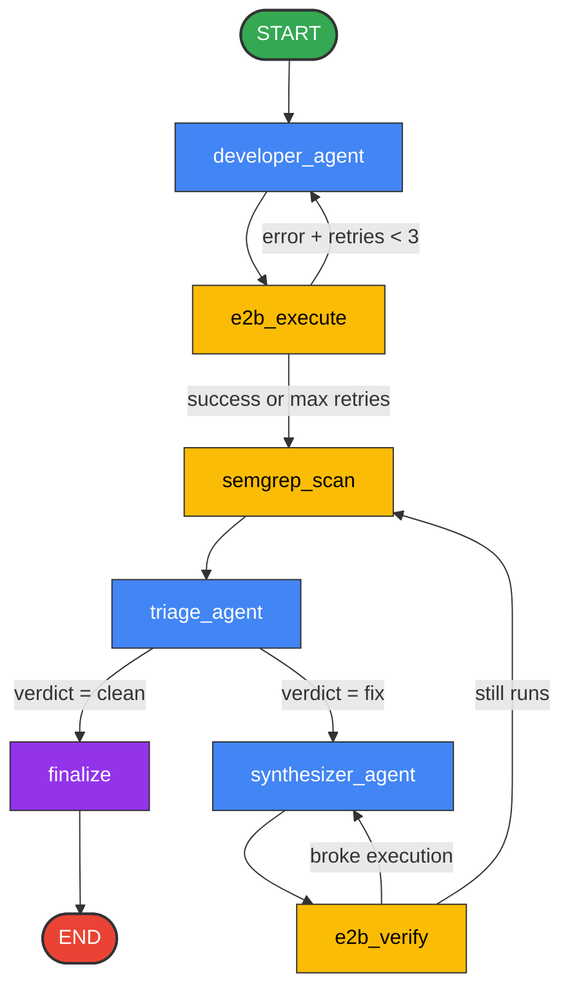

# CodeSentinel — Orchestrator Graph Diagram

This diagram visualizes the LangGraph state machine flow, agents, tool nodes, and conditional loops.

### Node Description
* **Blue Nodes**: LLM Agents (`gemini-2.0-flash`).
* **Yellow Nodes**: Functional Tools (E2B sandbox execution and Semgrep scanning).
* **Purple Node**: Finalizer and formatter logic.
